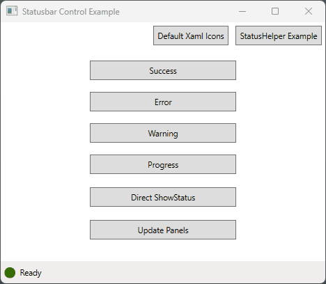

# WPF Statusbar Helper and Control
 <a href="https://www.nuget.org/packages/Westwind.Wpf.Statusbar/"></a> 


This is a small WPF library that provides Statusbar functionality in a couple of different ways. 

* A basic statusbar control
* A Statusbar Helper you can apply against your own status bars




## Installation and base Usage
You can install this library from NuGet:

```ps
> dotnet add package Westwind.Wpf.Statusbar
```

To use the control add the following namespace to WPF Windows or controls:

```xml
<Window x:Class="SampleApp.MainWindow" ...
        xmlns:statusbar="clr-namespace:Westwind.Wpf.Statusbar;assembly=Westwind.Wpf.Statusbar"
>
```

And to use the control in a Window or Control:

```xml
<statusbar:StatusbarControl Grid.Row="1" Name="Statusbar" />
````

Alternately you can use the `StatusbarHelper` with your own existing Statusbar, provided it has an icon `Image` and a main `TextBlock`. You can attach the `StatusbarHelper` to the parent control or window and pass in the `Textblock` control and `Image` icon control which is then automated.

```csharp
 public partial class MyWindow : Window
 {
    public StatusbarHelper Status { get;  }

    public MyWindow()
    {
        InitializeComponent();
            
        Status = new StatusbarHelper(StatusText, StatusIcon);
        
        ...
    } 
 }        
```

To update status messages:

```csharp
// Using the control: shows status and resets to default  after 3 secs
Statusbar.ShowStatusSuccess("Yay. The operation was successful! ", 3000);

// Using the control: shows status and resets to default  after 2 secs
Statusbar.ShowStatusError("Ooops. Something went wrong!",2000);

// Using StatusHelper: shows status and resets to default  after 2 secs
Status.ShowStatusWarning("Careful... this might go sideways.", 2000);

// Using StatusHelper: shows spinning icon indefinitely
Status.ShowStatusProgress("This may take a minute...");
```


## Features

This library provides:

* **Simple Statusbar Control**  
A basic status bar control that has an icon plus 3 base status bar areas that can be individually accessed.

* **A Statusbar Helper**  
This helper allows you to attach the key features of the Statusbar control to a XAML layout of your own by explicitly passing in the icon image control and primary text control.

Both of these tools provide the following features:

* Simple ShowStatus methods to display common status modes
* Modes:  Success, Error, Warning, Progress
* Icons to display common states
* Icon animation for state change
* Animated progress icon
* Icon and text reversion to a default message and icon
* Stock icons provided, but you can override with any ImageSource


## Usage

### Statusbar Control
The status bar control can just be dropped onto a form by adding the following namespace:

```xml
<Window x:Class="SampleApp.MainWindow" ...
        xmlns:statusbar="clr-namespace:Westwind.Wpf.Statusbar;assembly=Westwind.Wpf.Statusbar"
>
```

and the actual control:

```xml
<statusbar:StatusbarControl Grid.Row="1" Name="Statusbar" />
````

In a window it looks like this:

```xml
<Window x:Class="SampleApp.MainWindow"
        xmlns="http://schemas.microsoft.com/winfx/2006/xaml/presentation"
        xmlns:x="http://schemas.microsoft.com/winfx/2006/xaml"
        
        xmlns:statusbar="clr-namespace:Westwind.Wpf.Statusbar;assembly=Westwind.Wpf.Statusbar"
        
        Title="MainWindow" 
        Height="400" Width="450">


    <Grid>
        <Grid.RowDefinitions>
            <RowDefinition Height="*"/>
            <RowDefinition Height ="Auto"/>
        </Grid.RowDefinitions>

        <StackPanel Width="200" Margin="20">
        ... Content here
        </StackPanel>

        <statusbar:StatusbarControl Grid.Row="1" Name="Statusbar" />
    </Grid>
</Window>
```

#### Showing Status Messages
Once the control is on the page you can simply call the properties to manipulate the status behavior.

The following are examples that demonstrate the basic operations *(note you wouldn't run them one after the other like this but each before/after an operation has completed)*

```csharp
// shows status and resets to default  after 3 secs
Statusbar.ShowStatusSuccess("Yay. The operation was successful! ", 3000);

// shows status and resets to default  after 2 secs
Statusbar.ShowStatusError("Ooops. Something went wrong!",2000);

// shows status and resets to default  after 2 secs
Statusbar.Status.ShowStatusWarning("Careful... this might go sideways.", 2000);

// shows spinning icon indefinitely
Statusbar.Status.ShowStatusProgress("This may take a minute...");
```

Note that you can either use the control's methods directly (first two examples) or you can use the `Status` property which is the `StatusbarHelper` control that does the actual work and can also be used independently of this control.#\

#### Updating Non-Primary Panels
The various status methods can be used to update the status bar's primary text panel and icon, but you can also set the optional center and right panels and assign text or content.

```csharp
// set with plain text
Statusbar.SetStatusCenter("Center Panel Text");

// set with control content
var sp = new StackPanel() { Orientation = Orientation.Horizontal };
sp.Children.Add(new TextBlock() { Text = "Right Panel Text" });
sp.Children.Add(new Image { Source = StatusIcons.Default.SuccessIcon, Height=15, Margin = new Thickness(3, 0 ,0, 0)});

Statusbar.SetStatusRight(sp);

// Update the primary panel's text only
Statusbar.StatusText.Text = "Pull it!";
```

### Statusbar Helper
The statusbar control is a quick way to drop a basic statusbar control on a page, but if you want more control over your status bar layout you can also create and manage your own Status bar XAML layout.

In order to use the `StatusbarHelper` class you need to make available the primary text control and an image control.

For example you can embed a status bar control like this into your own Xaml:

```xml
<StatusBar  
    Grid.Row="3" Height="30"  
    VerticalAlignment="Bottom" HorizontalAlignment="Stretch">
    <StatusBar.ItemsPanel>
        <ItemsPanelTemplate>
            <Grid>
                <Grid.ColumnDefinitions>
                    <ColumnDefinition Width="Auto" />
                    <ColumnDefinition Width="*" />
                    <ColumnDefinition Width="Auto" />
                    <ColumnDefinition Width="Auto"  />
                </Grid.ColumnDefinitions>
            </Grid>
        </ItemsPanelTemplate>
    </StatusBar.ItemsPanel>
    <StatusBarItem Grid.Column="0" Margin="2,1,0,0">
        <Image x:Name="StatusIcon" Source="{StaticResource circle_greenDrawingImage}"  Height="15" Width="15" Margin="0"  />
    </StatusBarItem>
    <StatusBarItem Grid.Column="1">
        <TextBlock Name="StatusText" x:FieldModifier="public" HorizontalAlignment="Left">Ready</TextBlock>
    </StatusBarItem>
    <StatusBarItem Grid.Column="2">
        <ContentControl Name="StatusCenter" 
                   Margin="10 0"
                   x:FieldModifier="public" HorizontalAlignment="Left" />
    </StatusBarItem>
    <StatusBarItem Grid.Column="3">
        <ContentControl x:Name="StatusRight" x:FieldModifier="public" HorizontalAlignment="Right" Margin="0 0 5 0" />
    </StatusBarItem>
</StatusBar>
```

> #### Status Bar Recommendations
> For best effect, there are a couple of recommendations for any custom status bars you use with `StatusHelper`:
>
>
> * Make the Statusbar a **fixed height** to avoid resizing on Flashing
> * Make the icon a fixed height and width (square ideally)

In the constructor of Window or Control that hosts this control you can then assign the `StatusbarHelper` as a property like this:


```csharp
 public partial class MyWindow : Window
 {
    public StatusbarHelper Status { get;  }

    public MyWindow()
    {
        InitializeComponent();
            
        Status = new StatusbarHelper(StatusText, StatusIcon);
        
        ...
    } 
 }        
```

To update status information you can then run commands like this:

```csharp
private void BtnSuccess_OnClick(object sender, RoutedEventArgs e)
{
    // use the controls methods
    this.Status.ShowStatusSuccess("Yay. The operation was successful! ", 3000);
}
```

## License
This library is published under **MIT license** terms.

**Copyright &copy; 2023 Rick Strahl, West Wind Technologies**

Permission is hereby granted, free of charge, to any person obtaining a copy of this software and associated documentation files (the "Software"), to deal in the Software without restriction, including without limitation the rights to use, copy, modify, merge, publish, distribute, sublicense, and/or sell copies of the Software, and to permit persons to whom the Software is furnished to do so, subject to the following conditions:

The above copyright notice and this permission notice shall be included in all copies or substantial portions of the Software.

THE SOFTWARE IS PROVIDED "AS IS", WITHOUT WARRANTY OF ANY KIND, EXPRESS OR IMPLIED, INCLUDING BUT NOT LIMITED TO THE WARRANTIES OF MERCHANTABILITY, FITNESS FOR A PARTICULAR PURPOSE AND NONINFRINGEMENT. IN NO EVENT SHALL THE AUTHORS OR COPYRIGHT HOLDERS BE LIABLE FOR ANY CLAIM, DAMAGES OR OTHER LIABILITY, WHETHER IN AN ACTION OF CONTRACT, TORT OR OTHERWISE, ARISING FROM, OUT OF OR IN CONNECTION WITH THE SOFTWARE OR THE USE OR OTHER DEALINGS IN THE SOFTWARE.